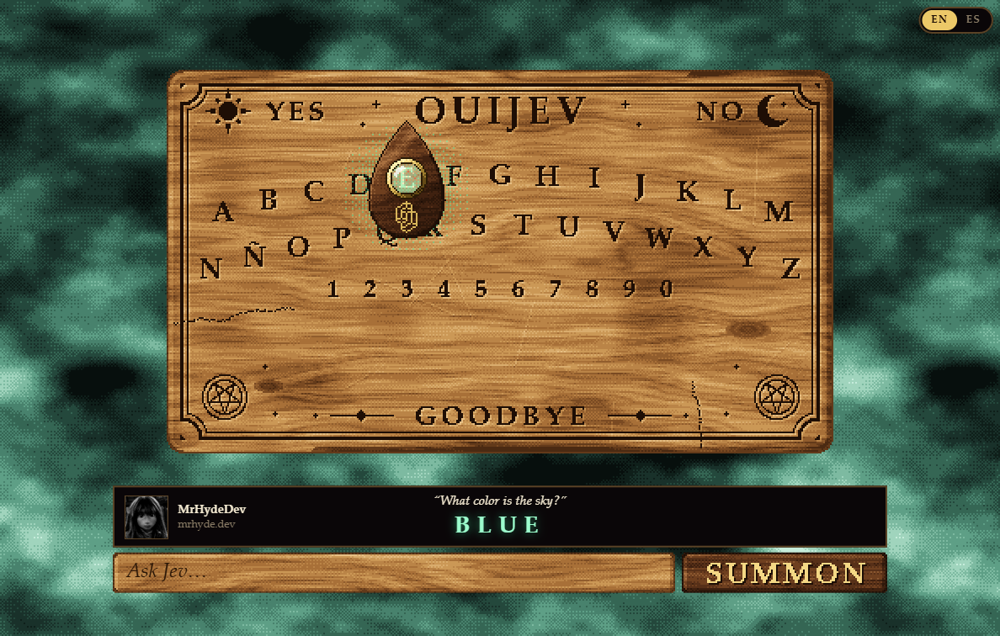

<p align="center">
  
</p>

<p align="center">
  <b>A pixel-art Ouija board possessed by an AI model that can't write.</b><br>
  <sub>A technical experiment. And a silly one, let's be honest.</sub>
</p>

<p align="center">
  <a href="https://github.com/MrHydeDev/ouijev/actions/workflows/ci.yml"></a>
  <a href="LICENSE"></a>
  <a href="https://nodejs.org/"></a>
</p>

<p align="center">
  
</p>

### `hyde@sunnydale:~$` cat README.md

[Jev](https://typesafe.ai) is TypeSafe AI's model, and it has a quirk: **it doesn't generate text**. It's a
_System One Model_: you give it a state and some typed questions, and it gives you back decisions (yes or no,
pick an option, score something) along with its confidence. No paragraphs, no "Sure! Here's…".

So the question was obvious: what if I put it inside a Ouija board and make it talk? (Necessary? No. Fun?
Quite.)

You type a question, the planchette trembles, the fog turns green and Jev decides where it lands. All the
pixel art (board, planchette, fog, even the buttons) is generated in code: the only images in the repo are the
ones in this README and my avatar.

The spirit answers in the language you ask in; the interface is in English or Spanish (the EN | ES switch in the
top right corner).

### `hyde@sunnydale:~$` ./ouijev --start

You need [Node.js](https://nodejs.org/) 22.13 or later.

```bash
git clone https://github.com/MrHydeDev/ouijev.git
cd ouijev
npm install
cp .env.example .env   # and fill in whatever you'll use
npm start              # → http://127.0.0.1:3666
```

- **With nothing configured** it starts in demo mode, with canned answers, so you can see the board without
  spending a cent.
- **With `TYPESAFE_API_KEY`** ([TypeSafe console](https://console.typesafe.ai/keys)) the real Jev answers. On
  its own it already says YES, NO and GOODBYE, and finds any other answer by reading, in Spanish or English: an
  open question's in its phrasebook, and the rest in its word list.
- **With a scribe** (`LLM_PROVIDER`, see below, always alongside the TypeSafe key) it answers in any language
  written in the Latin alphabet, and with more wit.

### `hyde@sunnydale:~$` man ouijev

How do you get words out of a model that doesn't write? Like this:

```text
                  ┌──► Jev: YES, NO, GOODBYE or words? What language? Open question? About what? ──► YES / NO / GOODBYE
                  │                               │
  "question?" ────┤                               ▼ words
                  │
                  └──► scribe (LLM): 6-8 candidates in that language ──► Jev picks one, or none ──► the planchette spells it
                                │
                                ▼ no scribe, or it fails
                       Jev reads in that language and picks the answer:
                       an open question's in the phrasebook, on its topic first; any other in the word list
```

1. **First decision, four questions at once.** In a single request (the SDK takes several named questions per
   call) Jev decides whether the answer goes straight to a spot on the board, YES, NO or GOODBYE, or needs
   words; what language the question is in; whether it's an open question, one with no factual answer; and
   what it asks about: who, where, when, why or how, or anything else. About 0.3 seconds.
2. **With a scribe, the scribe proposes and Jev picks.** While Jev decides, an LLM reads the question in
   parallel and proposes 6 to 8 answers of different kinds, in the question's language: the right one if there
   is one, a couple of plausible but wrong alternatives, something evasive, something cryptic, something
   unsettling (spooky, never harmful: the prompt rules out self-harm, violence, sex and hate). Jev picks one
   with another `choice`, which always includes "none of these" (it only wins if Jev is sure of it, from 50%
   up; then the spirit spells I DONT KNOW, or NO LO SE…). The LLM writes the options; Jev is the one answering.
3. **Without a scribe, Jev reads.** Jev can't write, but it recognizes the answer when it sees it, and it reads
   fast: a `choice` takes up to 255 options and a request takes many questions.
   - An open question gets its answer from the **phrasebook**: some 350 phrases per language written for the
     spirit and sorted by what they answer (TU CUÑADO, WHERE YOU NEVER LOOK, DE VIEJO, YOUR PHONE…, see
     [`data/`](data/README.md)). Jev reads the ones on the question's topic first, and the rest only if none
     answers. About 0.8 seconds and 6,000 tokens.
   - Any other goes to the **word list**: the 2,000 most frequent words of the question's language (plus the
     numbers up to 120 and the years 1900 to 2030), ten batches at once, and the other 6,000 if nothing there
     answers. So does an open question that no phrase answers. About a second and 40,000 tokens (140,000 if it
     has to read the whole list).

   From each batch, the few options Jev voted for go to a final choice among all of them, along with a yes/no
   on each one: the answer is the most voted one that Jev says answers the question ("none of them" only wins
   from 70% up). There are phrasebooks and word lists for Spanish and English; any other language gets English.

4. **The spirit's profile.** Jev is always told that its name is JEV, that it comes from TYPESAFE, that it's 1
   year old and that it's a spirit that lives in a machine (as a plain AI model, it answered NO to "are you a
   spirit?"). It only counts when the question is about the spirit itself (see the autopsy).
5. **The board only has Latin letters.** A question in Russian or Japanese gets its answer in English, and
   accents and apostrophes go away (É → E, DON'T → DONT) except for the Ñ, which has its own spot.

The server console narrates every decision along with its confidence. Real examples:

```text
"¿Quién me la tiene jurada?" → WORDS (77%) · ES · open (82%), WHO
  OpenCode Go · deepseek-v4.1-flash proposes, Jev picks: ALGUIEN CERCANO 33% · TU REFLEJO 25% · NONE OF THESE 15% · LA MUERTE 12% · …

"What do bees make?" → WORDS (98%) · EN · factual (93%)
  OpenCode Go · deepseek-v4.1-flash proposes, Jev picks: HONEY 91% · WAX 4% · GOLD 2% · SWEET 1% · …

Without a scribe:

"¿Quién me la tiene jurada?" → WORDS (79%) · ES · open (84%), WHO
  Jev read 72 phrases; finalists: QUIEN MENOS ESPERAS 45% · NADIE 12% · YO 7% · TU ENEMIGO 6%

"¿De qué color es el cielo?" → WORDS (99%) · ES · factual (91%)
  Jev read 2,252 words; finalists: AZUL 39% · DEPENDE 29% · CAMBIA 11% · NINGUNO 4% · …
```

(Who's out to get me? Someone close to you; without a scribe, whoever you least expect. What color is the sky?
Blue.)

### `hyde@sunnydale:~$` cat lab.log

None of this was chosen by eye. Before settling on it, a lab asked 40 questions (yes/no, facts, questions about
the spirit and open ones, in Spanish, English, French, Italian, Portuguese, Russian and Japanese) to the real
Jev, trying out each idea:

| Strategy                                                              | Right (of 32) | Median | Jev tokens per question |
| --------------------------------------------------------------------- | ------------- | ------ | ----------------------- |
| **With a scribe (this one)**: 6-8 candidates, Jev picks one           | **31**        | 2.4 s  | ~1,400                  |
| **Without a scribe (this one)**: the phrasebook, or the word list     | **31**        | 1.0 s  | ~30,000                 |
| Without a scribe, the word list for everything (the previous version) | 30            | 1.1 s  | ~35,000                 |
| The first version (Spanish only)                                      | 23            | 1.3 s  | ~1,000                  |
| A jury: 24 candidates, each one judged on its own                     | 28            | 2.7 s  | ~2,700                  |
| An intent first (truth, riddle, omen, dodge or mockery), then words   | 25            | 4.0 s  | ~1,500                  |
| Jev picks the first letter, then reads the words with that letter     | 27            | 0.8 s  | ~23,000                 |

(The open questions have no right answer, so they aren't in the count. The two rows marked "this one" come from
the latest `npm run eval`, on the same 40 questions; its misses are ARE YOU ALIVE, which is on the fence for
Jev (40% NO, 40% YES, and it goes either way), and, without a scribe, BRASILIA, which isn't in the word list.)

What it taught: the old system was already spot on in Spanish, and all of its misses were answers in the wrong
language (ROMA, VERDE, GATO to questions in English). More candidates didn't make it more accurate, only slower;
choosing an intent first made the answers wordier and worse (ME LLAMO JEV instead of JEV). And without a scribe,
reading beats spelling by a mile. What still goes wrong: without a scribe, words that aren't in the lists (BRASILIA)
and French questions answered in English.

Then a second lab went after the open questions, where Jev alone answered with the blandest words on its list
(DEPENDE, VEREMOS, EVENTUALLY: the most frequent words fit any question). It asked 25 of them, in Spanish, English
and French, and a blind judge compared the answers: two models from other families than the scribe's (GPT-6 Luna
and Kimi K3), two answers to the same question at a time, each pair in both orders, so four votes per question.

| Where the answer comes from (25 open questions)        | Median | Jev tokens per question |
| ------------------------------------------------------ | ------ | ----------------------- |
| The scribe's candidates                                | 2.5 s  | ~1,300                  |
| **The phrasebook, on the question's topic (this one)** | 0.8 s  | ~4,800                  |
| The whole phrasebook                                   | 0.8 s  | ~9,000                  |
| The word list (the previous version)                   | 1.0 s  | ~72,000                 |

| Head to head (votes)                         | Won | Lost | Tied                 |
| -------------------------------------------- | --- | ---- | -------------------- |
| The phrasebook on the topic vs the word list | 43  | 6    | 1                    |
| The whole phrasebook vs the word list        | 37  | 13   | 0                    |
| The phrasebook on the topic vs the whole one | 20  | 12   | 36 (the same answer) |
| The scribe vs the word list                  | 48  | 2    | 0                    |
| The scribe vs the phrasebook on the topic    | 31  | 17   | 4                    |

| Question                                                   | The word list | The phrasebook       | The scribe       |
| ---------------------------------------------------------- | ------------- | -------------------- | ---------------- |
| ¿Cuándo me voy a morir? _(when will I die?)_               | VEREMOS       | CUANDO NO LO ESPERES | CUANDO OLVIDES   |
| Where did I hide my keys?                                  | POCKETS       | WHERE YOU NEVER LOOK | LOOK BEHIND YOU  |
| ¿Qué se oye por las noches en el desván? _(in the attic?)_ | RUIDO         | RATONES              | SUSURROS         |
| Who else lives in this house?                              | NOBODY        | A SPIRIT             | BEHIND YOU       |
| What should I do with my life?                             | DEPENDS       | LIVE                 | FOLLOW THE LIGHT |

What it taught:

- Reading only what could be an answer beats reading everything: a book of phrases twenty times shorter than the
  word list wins 43 to 6, for a fifteenth of the tokens.
- The dodges had to go (maybe, who knows, time will tell), and so did the catch-alls (NOTHING, EVERYTHING,
  YOURSELF): they fit every question, so Jev picked them for every question.
- The yes/no on each finalist rewards the safe answer; the choice among all of them, side by side, the evocative
  one. So the choice picks, and the yes/no can only rule a finalist out.
- The spirit's profile leaks: it says it's a spirit that lives in a machine, so with LA MÁQUINA among the
  phrases, Jev voted for it again and again, even to where did I hide my keys. It isn't in the book.
- Asking the topic in the first request costs almost nothing (it goes along with the other three questions),
  halves what Jev reads and keeps the answers on the question.
- The scribe still wins: an LLM writes answers for this very question, and no book can. But Jev alone no longer
  says "it depends".

(The judge compared the lab's phrasebook; the one in `data/` is the same with a few repeats merged and a few
phrases shortened.)

`npm run eval` asks the real app the questions of both labs (and spends real credit, so it only runs on purpose).

### `hyde@sunnydale:~$` cat autopsy.log

The very first attempt was the obvious one: ask Jev for the first letter, then the second, and so on until it
chose the end. No help at all. It was a beautiful disaster:

| Question                                                        | Bare Jev     | + dictionary as rails | + words in sight |
| --------------------------------------------------------------- | ------------ | --------------------- | ---------------- |
| ¿Cuál es la capital de Francia? _(capital of France?)_          | PASSA        | PARIS                 | PARIS            |
| ¿De qué color es el cielo? _(color of the sky?)_                | BCASTSTSTTSB | BLEDO                 | AZUL             |
| ¿Cómo se llama el satélite de la Tierra? _(Earth's satellite?)_ | MNOA         | MONO                  | LUNA             |
| ¿Qué animal ladra? _(which animal barks?)_                      | DACGE        | DABA                  | PERRO            |

Why it failed:

- **Errors compound.** Given the right prefix, it got 15 letters out of 22 right (68%). A five-letter word needs
  six hits in a row (the letters plus the end): 0.68⁶ ≈ 10% perfect words. And after the first miss,
  everything that follows is noise.
- **It thinks in English.** For the color of the sky it picked B (for _blue_) with 88%; for the satellite, M
  (_moon_), and for the barking animal, D (_dog_). Hence BLEDO, MONO and DABA, instead of AZUL, LUNA and PERRO.
- **It doesn't know when to stop.** MONNNNNN, DADADADA.
- **Anecdote:** when I gave it the character profile so it would know its own name, it started answering JEV
  to everything. I had to spell out that that data only counts when it's asked about itself.

The moral is what the whole design rests on: a classifier can't spell, but it recognizes the answer when it
sees it. So the trick isn't teaching it to write, it's putting good options in front of it. Taken to the end,
that's why Jev doesn't spell anymore: it reads.

### `hyde@sunnydale:~$` ls providers/

The scribe can be almost any LLM. You pick it with `LLM_PROVIDER`, and the API key is read from `LLM_API_KEY`
or from the provider's usual variable:

| `LLM_PROVIDER` | Provider                      | Default model            | API key                                   |
| -------------- | ----------------------------- | ------------------------ | ----------------------------------------- |
| `opencode-go`  | [OpenCode Go][opencode-go]    | `deepseek-v4.1-flash`    | `OPENCODE_API_KEY`                        |
| `opencode-zen` | [OpenCode Zen][opencode-zen]  | `deepseek-v4.1-flash`    | `OPENCODE_API_KEY`                        |
| `openai`       | [OpenAI][openai]              | `gpt-6-luna`             | `OPENAI_API_KEY`                          |
| `anthropic`    | [Anthropic][anthropic]        | `claude-opus-5`          | `ANTHROPIC_API_KEY` (or `ant auth login`) |
| `gemini`       | [Google Gemini][gemini]       | `gemini-3.5-flash-lite`  | `GEMINI_API_KEY` or `GOOGLE_API_KEY`      |
| `openrouter`   | [OpenRouter][openrouter]      | `openai/gpt-6-luna`      | `OPENROUTER_API_KEY`                      |
| `deepseek`     | [DeepSeek][deepseek]          | `deepseek-flash`         | `DEEPSEEK_API_KEY`                        |
| `groq`         | [Groq][groq]                  | `openai/gpt-oss-20b`     | `GROQ_API_KEY`                            |
| `mistral`      | [Mistral][mistral]            | `mistral-small-latest`   | `MISTRAL_API_KEY`                         |
| `ollama`       | [Ollama][ollama] (local)      | `llama3.2:3b`            | not needed                                |
| `lmstudio`     | [LM Studio][lmstudio] (local) | none, so set `LLM_MODEL` | `LM_API_TOKEN`, if you turn on auth       |
| `custom`       | Any OpenAI-style API          | your call                | optional                                  |

A few details:

- Almost all of them speak OpenAI's _Chat Completions_ protocol. Gemini goes through its native API and
  Anthropic through its [official SDK](https://github.com/anthropics/anthropic-sdk-typescript), with structured
  output so the response is always valid JSON. With the default Claude Opus 5, server-side _fallbacks_ are turned
  on as well: if a safety classifier declines a request, it's retried on the fallback model.
- The default models are fast and cheap (Anthropic's, Opus 5, is the exception), and run with reasoning off or at
  its minimum: when they think they take three times as long and the candidates come out the same. Those settings
  only apply to the default model; if you change `LLM_MODEL`, tune yours with `LLM_EXTRA_BODY`:
  `{"reasoning_effort": "low"}` adds a parameter and `{"response_format": null}` removes one your model doesn't
  accept.
- `lmstudio` and `custom` have no default model: set `LLM_MODEL` (for LM Studio, the one you loaded). `custom`
  works with any OpenAI-compatible API and also needs `LLM_BASE_URL`.
- If the scribe fails or takes longer than `LLM_TIMEOUT_MS`, no big deal: Jev answers on its own.
- **Honesty first:** I've only tried it live with OpenCode Go. The rest is built against each provider's
  official docs (September 2026) and covered by tests. If one of them complains, open an issue.
- OpenCode Go is a subscription built around coding agents, and [its docs](https://opencode.ai/docs/go/) note
  that it monitors traffic: check that its terms fit how you'll use it. OpenCode Zen is its pay-as-you-go
  alternative.

Every variable, with its explanation, is in [`.env.example`](.env.example).

### `hyde@sunnydale:~$` tree

```text
src/
├── main.js            start-up: configuration, Jev, scribe and server
├── config.js          environment variables, validated with messages that say what to do
├── log.js · text.js   leveled logger and the board's alphabet
├── vocabulary.js      the spirit and the words the medium and the scribe share
├── medium/            the medium: orchestrates Jev's decisions
│   ├── medium.js          the first decision → the scribe's candidates, or Jev reading
│   ├── questions.js       the typed questions (choice, noul) Jev gets asked
│   ├── search.js          Jev reading, stage by stage, and its final choice
│   ├── library.js         loading what it reads: the phrasebooks and the word lists
│   ├── jev.js             the TypeSafe client, and what its errors mean to the user
│   ├── demo.js            canned answers for demo mode
│   └── errors.js          the errors a seance can end with, safe to show
├── scribe/            the scribe: the LLM that proposes candidates
│   ├── scribe.js · prompt.js   the request and parsing the response
│   ├── providers.js       the provider catalog
│   ├── deep-merge.js      how parameters, tuning and LLM_EXTRA_BODY combine
│   └── protocols/         OpenAI-compatible, Anthropic (SDK) and Gemini
└── server/            HTTP with no framework: NDJSON, static files and security headers
public/
├── index.html · style.css
├── avatar_220.jpg     the signature (same one as on mrhyde.dev)
└── js/                all the pixel art, generated in code
    ├── board.js           grained, knotted wood and the embossed carving
    ├── planchette.js      walnut, brass and the TypeSafe AI logo
    ├── fog.js             three sliding layers of dithered noise
    ├── seance.js          the planchette's state machine (no DOM, tested)
    ├── scene.js · fit.js  the frame, and fitting it to the window
    ├── i18n.js · language.js   the interface in English and Spanish, and picking one
    ├── api.js             the API client (tested)
    ├── layout.js          where every letter and word sits on the board
    ├── pixel.js · wood.js · palettes.js · font.js   noise, dithering, grain, colors and pixel type
    ├── controls.js        the input and the button, painted as wood
    ├── motion.js · debug.js   reduced motion, and the console tools of ?debug
    └── main.js            the glue
data/                  the phrasebooks, and 8,000 common words, in Spanish and English (see data/README.md)
scripts/               rebuilding the word lists (with its blocklist), and the eval (npm run eval) with its questions
docs/                  the banner and the screenshot in this README
test/                  node:test, no extra dependencies
```

About the pixel art: the scene is painted at 460 × 260 and scaled to an integer multiple of the physical
pixels, so every pixel comes out square (except in small windows, where an integer scale would waste too much
of the screen). Shades come from short ramps with 4 × 4 Bayer _dithering_, the font is a system serif,
rasterized and thresholded, and the fog is three periodic noise tiles quantized to a gray ramp that turns green
when the spirit is present. With `prefers-reduced-motion`, the fog and the planchette stay still (except to
move from letter to letter).

### `hyde@sunnydale:~$` cat DESIGN

A few rules the code keeps, so it's easy to follow and to test:

- **One place wires everything.** `src/main.js` reads the configuration and builds Jev, the scribe, the medium
  and the server. Every other module gets what it needs passed in (`createMedium({ jev, scribe, library })`,
  `createApp({ medium, … })`, `createScribe(config, { fetch })`), so the tests hand it fakes instead of
  patching modules.
- **Narrow interfaces.** The server only knows a medium with a `consult(question)` that yields events; the medium
  only knows a `jev` with a `systemOne` and a scribe with a `propose` (and a `label` for the log); the search only
  knows a `decide(questions)` function.
- **Vendors stay at the edges.** Only `src/medium/jev.js` knows the TypeSafe SDK's client and errors (it turns
  them into codes the page can show), and each LLM API is an adapter in `src/scribe/protocols/` behind the same
  `complete()`. The same timeout, cancellation and refusal tests run against all three.
- **Data instead of branches.** A provider is an entry in a frozen catalog (`src/scribe/providers.js`): a new
  OpenAI-compatible one is an object, not code. SDK errors map to codes through a table, and the board's layout
  is data that both the drawing and the planchette's movement read.
- **Pure where it can be.** Normalizing text, parsing the scribe's answer, merging parameters, building Jev's
  questions, the search (given `decide`), resolving static paths and the board's scaling rule are
  plain functions, tested without a server or a browser. The planchette's state machine
  (`public/js/seance.js`) doesn't touch the DOM.
- **Every input is checked once, where it comes in:** environment variables in `src/config.js`, requests in
  `src/server/app.js`, the LLM's output in `src/scribe/prompt.js`, Jev's errors in `src/medium/jev.js`.
- **Cancellation goes all the way.** A closed tab aborts one signal that reaches every request to Jev and to the
  scribe, and whatever is still running when a seance ends is canceled too.
- **Contracts are tested where code can't be shared** (there's no build step): the board's words and alphabet,
  the question's length limit and the error codes must match between the server and the page, and tests check
  that they do.

### `hyde@sunnydale:~$` npm run check

```bash
npm run dev            # server that restarts when src/ or data/ change
npm test               # tests (node:test)
npm run lint           # ESLint
npm run format         # Prettier
npm run check          # all three, like CI does
npm run build:words -- es_50k.txt en_50k.txt   # rebuild the word lists
npm run eval           # the labs' 57 questions, asked to the real Jev (spends credit; -- --no-scribe: Jev alone)
```

- With `?debug` in the URL you get `window.ouijev` in the console: `ouijev.simulate(3000)` fast-forwards the
  animation and `await ouijev.snapshot({ withInterface: true })` returns a capture of the scene (that's how the
  one above was made).
- The API is tiny. `POST /api/ask` returns the answer as [NDJSON](https://github.com/ndjson/ndjson-spec), one
  event per line as Jev decides:

  ```bash
  curl -N localhost:3666/api/ask -H 'Content-Type: application/json' -d '{"question": "Is anyone there?"}'
  # {"type":"word","word":"YES"}
  ```

  The events are `word` (YES, NO, GOODBYE), `letters` (text the planchette has to point at) and, if something
  fails midway, a final `error`. A request that fails before the first event (an invalid question, a wrong API
  key, Jev taking too long…) gets `{"error": {"code": "…", "message": "…"}}` with its 4xx/5xx status instead. The
  codes are stable and the page shows its own translation of them; the message is English, for whoever calls
  the API by hand. The page also sends `lang`, the interface's language, which only the demo uses (the spirit
  answers in the question's), and calls `GET /api/status`, which answers `{"mode": "live"}` or `"demo"`.

### `hyde@sunnydale:~$` cat DISCLAIMER

- **Personal, unofficial project**: I have nothing to do with TypeSafe AI. The TypeSafe AI name and logo are
  theirs, used only to say whose model answers; they'll be removed if TypeSafe AI asks. Ouija is a trademark of
  Hasbro, which has nothing to do with this either.
- **Your keys stay on your machine**: they live in `.env` (which git ignores) and the server only listens on
  localhost. It also turns away requests from other sites (CSRF) and those addressed to another domain (DNS
  rebinding), so no random page you visit can burn through your tokens. If you open it up to the world with
  `HOST`, anyone who reaches it can; it still turns away every domain name but `localhost`, so open it by IP
  address (`http://192.168.1.20:3666`).
- **Nobody keeps your questions**, except the providers you send them to (TypeSafe and whichever scribe you
  pick), which have their own policies. No cookies and no analytics. Obviously.
- The answers are picked by an AI model inside a Ouija board. Don't buy bitcoin because it told you to
  (spoiler: it says NO).

### `hyde@sunnydale:~$` cat LICENSE

The code is [MIT](LICENSE) © MrHydeDev, with three exceptions:

- The word lists in [`data/`](data/README.md) derive from [FrequencyWords](https://github.com/hermitdave/FrequencyWords)
  (Hermit Dave, built from OpenSubtitles subtitles) and are distributed under
  [CC BY-SA 4.0](https://creativecommons.org/licenses/by-sa/4.0/).
- The TypeSafe AI logo on the planchette belongs to TypeSafe AI.
- My avatar (`public/avatar_220.jpg`) isn't covered by the MIT license.

---

<p align="center"><a href="https://x.com/MrHydeDev">x.com/MrHydeDev</a> · <a href="https://mrhyde.dev">mrhyde.dev</a></p>

[opencode-go]: https://opencode.ai/docs/go/
[opencode-zen]: https://opencode.ai/docs/zen/
[openai]: https://platform.openai.com/api-keys
[anthropic]: https://platform.claude.com/settings/keys
[gemini]: https://aistudio.google.com/apikey
[openrouter]: https://openrouter.ai/settings/keys
[deepseek]: https://platform.deepseek.com/api_keys
[groq]: https://console.groq.com/keys
[mistral]: https://console.mistral.ai/api-keys
[ollama]: https://ollama.com/
[lmstudio]: https://lmstudio.ai/
